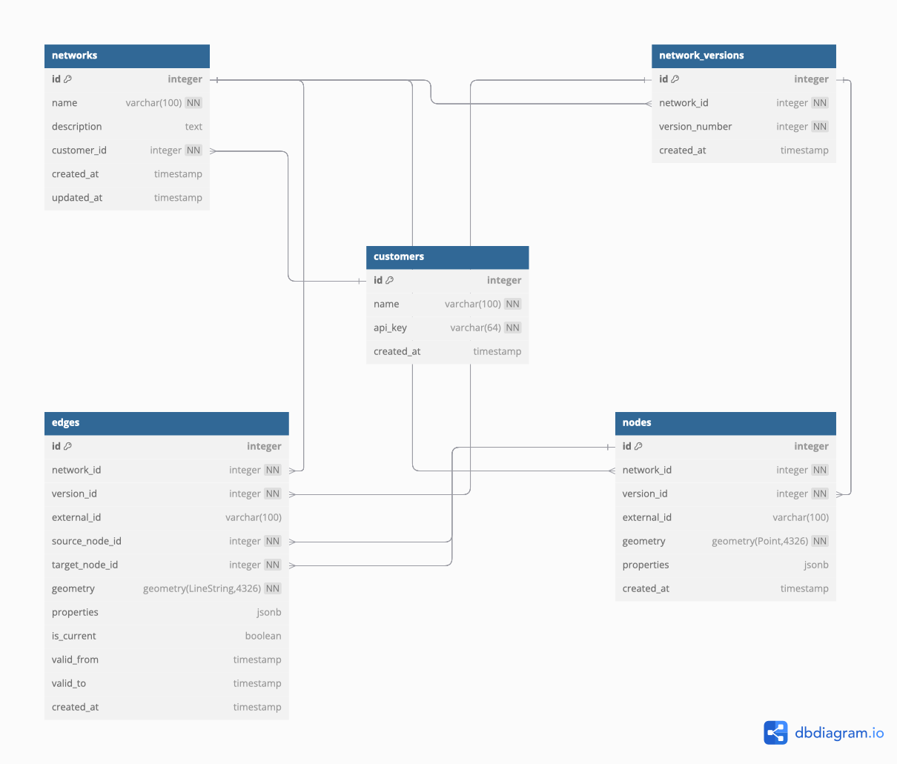

# Road Network API

A RESTful API for managing road networks with versioning support, built using FastAPI, PostgreSQL, and PostGIS.

## Features

- Create and manage road networks with GeoJSON data
- Version control for road networks
- Spatial queries for network edges and nodes
- Customer authentication via API keys
- Docker containerization for easy deployment

## Tech Stack

- **FastAPI**: Modern, high-performance web framework for building APIs
- **PostgreSQL**: Relational database
- **PostGIS**: Spatial database extension for PostgreSQL
- **SQLAlchemy**: ORM for database interactions
- **Alembic**: Database migration tool
- **Docker**: Containerization
- **Pytest**: Testing framework

## Prerequisites

- Docker and Docker Compose
- Make (optional, for convenience commands)

## Getting Started

### Using Docker (Recommended)

The entire application is containerized with Docker, making setup and deployment straightforward:

1. Clone the repository:
```bash
git clone https://github.com/yourusername/road-network-api.git
cd road-network-api
```

2. Start the application:
```bash
make up
```
This will build and start all the required containers (API and databases).

3. Run database migrations:
```bash
make migrate-db
```

4. The API is now available at http://localhost:8000

### Available Make Commands

The project includes a Makefile with convenient commands:

```bash
# Format code
make format

# Start the application
make up

# Shut down the application
make down

# Remove containers and volumes
make down_volumes

# Run database migrations
make migrate-db

# Access application shell
make enter-app

# Access database shell
make enter-db

# Access test database shell
make enter-test-db

# Run tests
make test
```

## API Usage

For detailed information about API endpoints, request/response formats, and examples, please refer to the [API Documentation](API_DOCUMENTATION.md) file included in this repository.

### Authentication

All API endpoints (except customer creation) require authentication via the `X-API-Key` header.

#### Getting an API Key

1. First, create a customer to receive an API key:
```bash
curl -X POST http://localhost:8000/api/customers/ \
  -H "Content-Type: application/json" \
  -d '{"name": "Example Customer"}'
```

2. The response will include your API key:
```json
{
  "id": 1,
  "name": "Example Customer",
  "api_key": "your_generated_api_key",
  "created_at": "2025-04-12T15:30:45.123Z"
}
```

3. Use this API key in subsequent requests:
```bash
curl -X GET http://localhost:8000/api/networks/ \
  -H "X-API-Key: your_generated_api_key"
```

### Main Endpoints

- **Customers**: Create and manage API customers
- **Networks**: Create and manage road networks
- **Edges**: Query network edges with versioning support

## Database Schema



The database includes the following primary tables:
- **customers**: API users with authentication keys
- **networks**: Road network metadata
- **network_versions**: Version control for networks
- **nodes**: Junction points in the network
- **edges**: Road segments connecting nodes

## Running Tests

Tests are run in a separate containerized environment:

```bash
make test
```

This command will run all tests against the test database.

## Development Environment

For development with hot-reloading, the Docker configuration automatically mounts the local code directory and enables reload mode for FastAPI.

## Future Improvements

- Add support for more complex geospatial queries
- Implement caching layer for frequently accessed networks
- Create visualization tools for network data
- Add authentication with JWT tokens
- Expand analytics capabilities for network usage

## License

[MIT License](LICENSE)

## Contributing

1. Fork the repository
2. Create a feature branch (`git checkout -b feature/amazing-feature`)
3. Commit your changes (`git commit -m 'Add some amazing feature'`)
4. Push to the branch (`git push origin feature/amazing-feature`)
5. Open a Pull Request